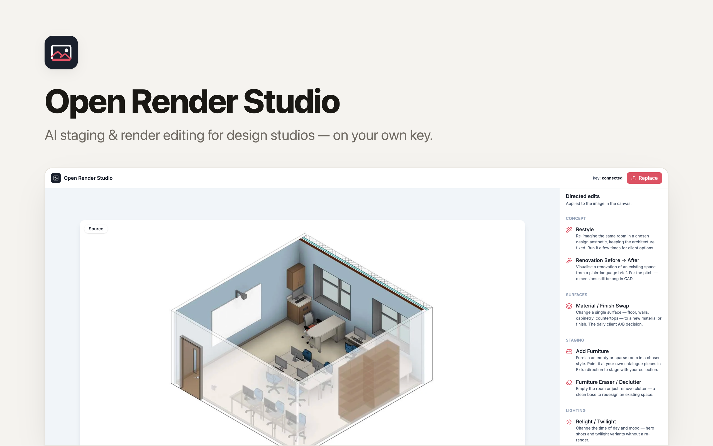

# Open Render Studio

AI staging & render editing for interior-design and archviz studios. Snap a room photo or drop in a CAD render, run one-click **directed edits** — restyle, material swap, furnish, declutter, relight, upscale, walkthrough video — and package the variants for a client. Built with **React + Tailwind CSS + Hono + D1**. Deploys to Cloudflare Workers via [Clawnify](https://clawnify.com).

An open-source, self-hostable alternative to Collov / InteriorAI — with three differences that matter:

- **Runs on your own image-model key** (Nano Banana / Gemini image via OpenRouter). No per-image subscription tax.
- **Agent-native** — every tool is also a callable action in the OpenAPI spec, so it works from a chat channel (snap a room in WhatsApp → variants back), not just a web app.
- **Grounded, not hallucinated** — every edit keeps the room's architecture, camera, and proportions fixed and changes only the one thing named. Tools that touch geometry return an honest note: verify dimensions in your CAD tool. This stays a post/ideation layer, not a fake CAD.

## Tools

Each tool is a preset directed edit against the source image. Add one by adding an entry to `src/server/tools.ts` — it appears in the UI grid *and* the agent API automatically.

| Tool | What it does |
|------|--------------|
| **Restyle** | Re-imagine the same room in a chosen aesthetic (Scandinavian, Japandi, …) |
| **Material / Finish Swap** | Change one surface — floor, walls, cabinetry, countertops |
| **Add Furniture** | Stage an empty room in a style; point it at your own catalogue |
| **Furniture Eraser / Declutter** | Empty the room or just remove clutter |
| **Renovation Before → After** | Visualise a renovation from a plain-language brief |
| **Relight / Twilight** | Change time of day and mood without a re-render |
| **Enhance & Upscale** | Portfolio-quality sharpen + upscale (fal SeedVR when a FAL key is set) |
| **Walkthrough Video** | Animate a still into a cinematic clip (fal Kling image-to-video) |

## Quickstart

```bash
git clone https://github.com/clawnify/open-render-studio.git
cd open-render-studio
pnpm install
```

Create a `.dev.vars` file with your OpenRouter API key:

```
OPENROUTER_API_KEY=your-key-here
# optional — enables Enhance/Upscale + Walkthrough Video:
# FAL_API_KEY=your-fal-key-here
```

Start the dev server:

```bash
pnpm dev
```

Open `http://localhost:5173`. The database schema is applied automatically on startup.

## Tech Stack

| Layer | Technology |
|-------|-----------|
| **Frontend** | React 19, TypeScript, Tailwind CSS v4, Vite |
| **Backend** | Hono (Cloudflare Worker) + `@hono/zod-openapi` |
| **Database** | D1 (SQLite at the edge) via `@clawnify/db` |
| **Storage** | R2 (source + result images/video) |
| **AI** | OpenRouter (Nano Banana / Gemini image edits); fal.ai (upscale + image-to-video) |

### Prerequisites

- Node.js 20+, pnpm
- [OpenRouter API key](https://openrouter.ai/keys) (required)
- [fal.ai key](https://fal.ai) (optional — upscale + video)

## Architecture

```
schema.sql          — Canonical schema (projects, renders, assets)
src/
  server/
    index.ts        — Hono API; runRender() is the single execution path
    tools.ts        — Directed-edit tool registry (UI + agent + prompts)
    image.ts        — Provider engine: editImage / upscaleImage / imageToVideo
    db.ts           — D1 adapter (@clawnify/db)
    uploads.ts      — R2 storage adapter
  client/
    app.tsx         — Upload → tool grid → param panel → variants
    api.ts          — Typed API client
```

### API

Human/UI routes are under `/api/*`. Agent-callable routes are in the OpenAPI spec at `/openapi.json`:

| Method | Endpoint | Description |
|--------|----------|-------------|
| GET | `/api/v1/tools` | List directed-edit tools + their inputs |
| POST | `/api/v1/render` | Run a tool on a source image → result URL |
| GET | `/api/tools` | Same tool list (UI) |
| POST | `/api/render` | Run a tool (UI) |
| GET/POST | `/api/projects` | Projects (a client engagement / room) |
| GET | `/api/projects/:id/renders` | Variants for a project |
| GET/POST | `/api/assets` | Studio's own furniture / style / material library |
| POST | `/api/uploads` | Upload an image |

### Schema & Migrations

`schema.sql` at the project root is the canonical schema for fresh deployments — edit it directly to add tables or columns. On a fresh deploy, Clawnify applies it once and records a baseline; deployed instances then evolve via auto-generated migration files. Don't hand-edit `schema.sql` inside a deployed instance (there it's an auto-regenerated snapshot).

## Deploy

```bash
npx clawnify deploy
```

## License

MIT
